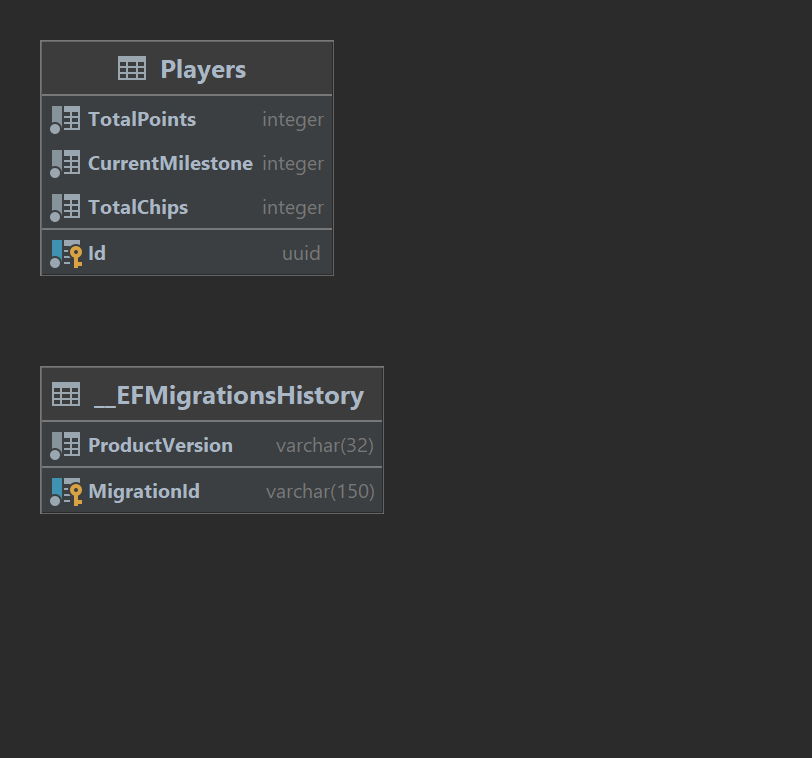

# Assignment

## 1. Development

### 1.1. Development environment
This project provides `docker-compose.yml` file which developers can run to setup development environment.
The `docker-compose.yml` file consists of:

- **Postgres SQL**: Database which is used in the project.

While developing with `docker-compose` command, please use the following commands:

```
# To start a fresh development environment, use the below command to destroy the existing container:
docker-compose --project-name assignment down

# To build the docker-compose.yml file & start the development environment. Use the below command:
docker-compose --project-name assignment -f docker-compose.yml up --detach
```

### 1.2. Environment variables

This project consists of **environment variable** which can be use to customized application logic.

```
ConnectionStrings__Application: <Connection string to postgres database>

Quest__RateFromBet: <Value of RateFromBet mentioned in assignment>
Quest__LevelBonusRate: <Value of LevelBonusRate mentioned in assignment>
Quest__TotalPoint: <Total point that user needs to complete the quest>

Quest__Milestones__<index>__TotalPoint: Milestone that the quest has (Miletones is an array)
Quest__Milestones__<index>__Chips: Amount of chip the player can receive when complete a milestone.

```

Example:
```
{
    "ConnectionStrings": {
        "Application": "User ID=linh.nguyen;Password=abcde12345-;Host=localhost;Port=5432;Database=assignment;Pooling=true;"
    },
    "Quest": {
        "RateFromBet": 5,
        "LevelBonusRate": 3,
        "TotalPoint": 150,
        "Milestones": [
          {
            "TotalPoint": 10,
            "Chips": 1
          },
          {
            "TotalPoint": 15,
            "Chips": 2
          },
          {
            "TotalPoint": 30,
            "Chips": 5
          },
          {
            "TotalPoint": 50,
            "Chips": 7
          },
          {
            "TotalPoint": 80,
            "Chips": 9
          },
          {
            "TotalPoint": 100,
            "Chips": 50
          }
        ]
    }
}

```

### 1.3. Migration

This project uses **postgres sql** as the main database, therefore:

- To make the application run, the following command **MUST BE USED** to run the database migration:
```
dotnet ef database update --project ./src/apis/Assignment.Apis/Assignment.Apis.csproj
```

- To generate a migration file, use the following command:
```
dotnet ef migrations add <name of migration> --project ./src/apis/Assignment.Cores/Assignment.Cores.csproj --startup-project ./src/apis/Assignment.Apis/Assignment.Apis.csproj
```

## 2. Api definition

- As the assignment mentioned, there are 2 apis mentioned in the application and one extra api.
- The api definition can be found in [miscellaneous/postman](miscellaneous/postman)
- To test the application, use the following apis sequentially:


### 2.1. Create user

- Create an user in the system to test.
```
curl --location 'http://localhost:5000/api/player' \
--header 'Content-Type: application/json' \
--data '{}'
```

### 2.2. Update user progress
```
curl --location 'http://localhost:5000/api/progress' \
--header 'Content-Type: application/json' \
--data '{
    "playerId": "1e53832f-f875-48ec-9483-86507c4ce74a",
    "playerLevel": 3,
    "chipAmmountBet": 10
}'
```

### 2.3. Get user state
```
curl --location 'http://localhost:5000/api/state/1e53832f-f875-48ec-9483-86507c4ce74a'
```

## 3. Database diagram.
The database diagram can be found in [miscellaneous folder](miscellaneous) with the following design:


Which has:

- **Players table**: To save information of a player.
  - What milestone player is at.
  - How many points have been added to that player

- **_EFMigrationsHistory**: An auto-generated table of EF Core to manage migration histories.
